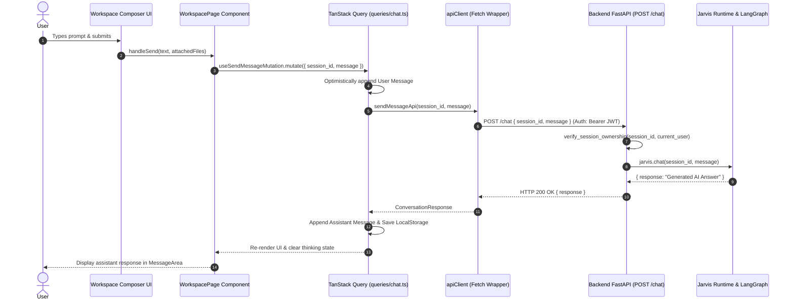
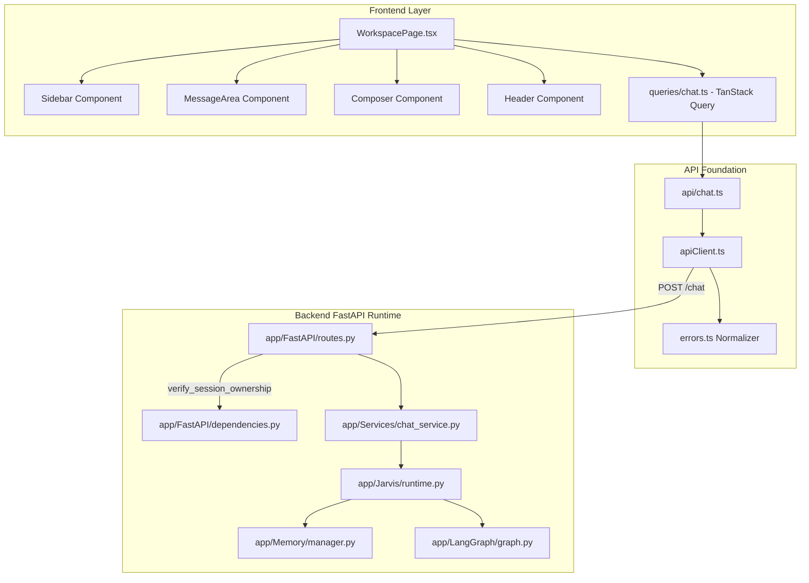

# Architecture Diagram: Sprint 5.3 Conversation Integration

```mermaid
sequenceDiagram
    autonumber
    actor User
    participant Composer as Workspace Composer UI
    participant WorkspacePage as WorkspacePage Component
    participant ReactQuery as TanStack Query (queries/chat.ts)
    participant APIClient as apiClient (Fetch Wrapper)
    participant FastAPI as Backend FastAPI (POST /chat)
    participant Runtime as Jarvis Runtime & LangGraph

    User->>Composer: Types prompt & submits
    Composer->>WorkspacePage: handleSend(text, attachedFiles)
    WorkspacePage->>ReactQuery: useSendMessageMutation.mutate({ session_id, message })
    ReactQuery->>ReactQuery: Optimistically append User Message
    ReactQuery->>APIClient: sendMessageApi(session_id, message)
    APIClient->>FastAPI: POST /chat { session_id, message } (Auth: Bearer JWT)
    FastAPI->>FastAPI: verify_session_ownership(session_id, current_user)
    FastAPI->>Runtime: jarvis.chat(session_id, message)
    Runtime-->>FastAPI: { response: "Generated AI Answer" }
    FastAPI-->>APIClient: HTTP 200 OK { response }
    APIClient-->>ReactQuery: ConversationResponse
    ReactQuery->>ReactQuery: Append Assistant Message & Save LocalStorage
    ReactQuery-->>WorkspacePage: Re-render UI & clear thinking state
    WorkspacePage-->>User: Display assistant response in MessageArea
```

## System Component Relationships

```mermaid
graph TD
    subgraph Frontend Layer
        A[WorkspacePage.tsx] --> B[Sidebar Component]
        A --> C[MessageArea Component]
        A --> D[Composer Component]
        A --> E[Header Component]
        A --> F[queries/chat.ts - TanStack Query]
    end

    subgraph API Foundation
        F --> G[api/chat.ts]
        G --> H[apiClient.ts]
        H --> I[errors.ts Normalizer]
    end

    subgraph Backend FastAPI Runtime
        H -->|POST /chat| J[app/FastAPI/routes.py]
        J -->|verify_session_ownership| K[app/FastAPI/dependencies.py]
        J --> L[app/Services/chat_service.py]
        L --> M[app/Jarvis/runtime.py]
        M --> N[app/Memory/manager.py]
        M --> O[app/LangGraph/graph.py]
    end
```
